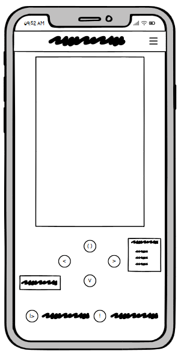
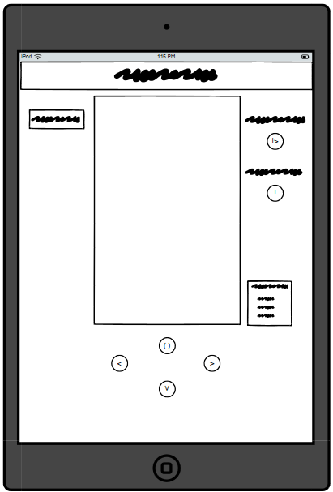
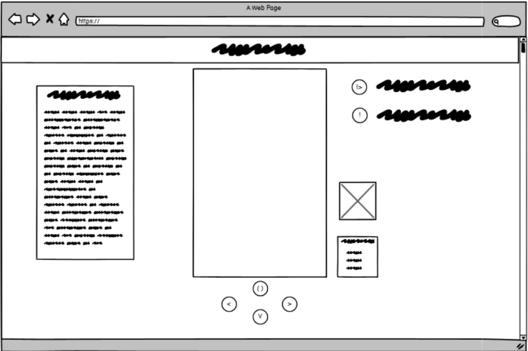

# Tetris Hackathon Project

#### Try it out here: 

#### Team members: [<ins>_Tom Fearn_</ins>](https://github.com/TomFearn)  [<ins>_Jude Woolls_</ins>](https://github.com/judewoolls)  [<ins>_Alex Rodrigues_</ins>](https://github.com/A-SousaRodrigues)

## Contents

1. [Overview](#overview)
2. [Project Planning](#project-planning)
3. [Project Development](#project-development)
4. [Project Deployment](#project-deployment)
5. [Testing](#testing)
6. [Impact of AI](#impact-of-ai)
7. [Sources](#sources)

## Overview

This is our version of Classic Tetris. We made this for our first Hackathon project of our Code Insitute course.
Using frontend technologies we chose to make a game out of the options provided. The project consists of one HTML file,
one JavaScript file, a stylesheet and a readME. Furthermore, we implemented the bootstrap framework to position the index.html
contents for the webpage.

#### What is tetris?

Tetris is a classic arcade game where the player is given randomly selected blocks that move down the screen. Each block is made of 4 cells and can be moved left, right, or down, and rotated. A block stops moving when one of its cells contacts another cell in the game area. The player scores points by filling a row with cells. When a row is filled, it is cleared, and the cells above move down, increasing the player's score. The game continues until there is no room to add new shapes. The player's score is then compared to the high score, which is updated if the player's score is higher.

## Project Planning

#### Our final project board:
#### Our initial miro board: [Tetris miro board](https://miro.com/app/board/uXjVL_bgpm8=/)

### <ins>Must-Have User Stories</ins>

> #### Title: Start Game Button
> #### User Story: As a user I want to be able to start the game when I choose not when the webpage loads.
>
> #### Acceptance Criteria:
> - The game does not automatically start when the webpage loads.
> - A "Start Game" button is displayed for the user to begin the game.
> - Clicking the "Start Game" button starts the game.
> #### Tasks:
> - Create a "Start Game" button in the UI.
> - Prevent game logic from running on page load.
> - Implement functionality to start the game when the button is clicked.

> #### Title: Move block left and right
> #### User Story: As a user I want to be able to interact with the game and have control over the direction of the blocks.
>
> #### Acceptance Criteria:
> - Users can move blocks left and right using keyboard inputs (e.g., left and right arrow keys).
> - Movement is smooth and responsive during gameplay.
> - Blocks do not move beyond the edges of the game grid.
> #### Tasks:
> - Map left and right arrow keys to block movement.
> - Implement logic to move blocks left and right within the grid boundaries.
> - Test responsiveness of left and right movement during gameplay.

> #### Title: Clear a line when filled
> #### User Story: As a user I want to be able progress in the game and clear lines
>
> #### Acceptance Criteria:
> - The game row is cleared when the row is full
> - The rest of the blocks move down
> #### Tasks:
> - Loop through each row of the board and check it is filled
> - Update the game board to remove a full row
> - Update the game board to move the rest of the blocks down

> #### Title: Score increases with lines cleared
> #### User Story: As a player I want to be able to score points as I play the game.
>
> #### Acceptance Criteria:
> - The score updates each time a row is filled
> #### Tasks:
> - Target the score display text and add the score

> #### Title: Display High Score
> #### User Story: As a user, I want to see the high score displayed, so I can track the best performance in the game.
>
> #### Acceptance Criteria:
> - The high score is displayed prominently on the game screen.
> - The high score is updated whenever a new higher score is achieved.
> #### Tasks:
> - Add a section in the UI to display the high score.
> - Implement logic to update the high score when a new higher score is achieved.

### <ins>Should-Have User Stories</ins>

> #### Title:
> #### User Story: 
>
> #### Acceptance Criteria:
> - Users can rotate blocks using a designated keyboard input (e.g., W).
> - Rotation is smooth and responsive during gameplay.
> - Blocks rotate within the boundaries of the game grid.
> - Blocks do not overlap with other blocks or exceed grid boundaries when rotated.
> #### Tasks:
> - Map a keyboard key (e.g., W) to block rotation.
> - Implement logic to rotate blocks clockwise.
> - Add collision detection to prevent rotation if it causes overlaps or boundary violations.
> - Test the responsiveness and accuracy of block rotation during gameplay.

> #### Title: Reset button
> #### User Story: As a user I want to reset the game whenever I want if i am not happy with my progress or if the game stops working.
>
> #### Acceptance Criteria:
> - A button that when clicked/pressed resets the game state and restarts a new game
> #### Tasks:
> - The button breaks out of the game loop and restarts it

### <ins>Could-Have User Stories</ins>

> #### Title: Increase block speed as score increases
> #### User Story: As a player, I want the block speed to increase as my score goes up, so that the game becomes more challenging as I progress.
>
> #### Acceptance Criteria:
> - The falling speed of blocks increases automatically as the player’s score reaches specific thresholds.
> - Speed adjustments are smooth and do not interrupt gameplay.
> - The speed cannot decrease, even if the score drops.
> - Speed levels and thresholds are clearly defined in the game logic.
> #### Tasks:
> - Define score milestones at which block speed increases (e.g., every 5 points).
> - Implement logic to increase block speed when these milestones are reached.
> - Ensure that the speed increase is gradual and does not cause gameplay to feel abrupt or unfair.
> - Test the game to verify that the block speed increases correctly as the score increases.

> #### Title: Multiplier for multiple lines cleared
> #### User Story: As a player I want to be awarded more points for clearing more rows.
>
> #### Acceptance Criteria:
> - The game checks for multiple rows and adds appropriate score
> #### Tasks:
> - Check the game board for multiple full rows
> - Apply multiplier to score
> - Add the score to score element

### Wire Frames

**Mobile Wireframe**

**Tablet Wireframe**

**Desktop Wireframe**

## Project Development

### Our Approach

We chose to use Google meets to conistently check in with eachother throughout the day. We would allocate and decide what parts of the project we should tackle next. We would also make use of sharing the screen with each other when we needed to talk through an issue. This meant that all team members were able to work together and avoid conflicts.  

>### Key Successes
>
>We mostly avoided merge conflicts as we set up our project together in a clear structure and by using communication and regularly pulling from the updated main branch to be adding our code to the most up to date version.
>
>We planned well and we had an agreed approach to the project which helped to make the development process easier.

>### Challenges we Faced
>
>#### Minor issues
>- We had used different variable names

## Project Deployment

To deploy our tetris game we used GitHub pages which is a free platform to host webpages. We deployed as early as possible and we first published when we had our MVP (minimum viable product).

## Testing

#### Validation

#### Lighthouse test

#### Responsiveness Test

#### Manual Tests

## Impact of AI

### What AI tools did we use?

We used the GitHub co-pilot extension mainly using the chat window but also the in-line prompting.

### What did we use it for?

We used AI for debugging adn to explain any bugs and suggest possible fixes to these issues.

#### Here is an Example:
 
>__Bug__: we had a bug where the game loop would throw an error when the block reached the bottom of the play area.
>
>__Co-pilot Explanation__: the function used for checking for indexes that were out of range
>
>__Actions taken__: Co-pilot also suggested a quick one line fix to check that the index was within the correct range and once it had explained the code to us it was implemented.

We were also able to use the chat feature to explain code that others had written to get a faster understanding of our current progress in the project and to ensure that any features added were compatible with the other features the team had implemented.

### <ins>Summary</ins>

The AI tools used did have a positive impact on our project. They significantly improved our efficiency by providing quick explanations to bugs and offering code explanations. This allowed us to focus more on developing the key features rather than spending excessive time debugging. The ability to quickly understand and integrate each other's code through AI explanations also enhanced our collaboration and productivity.

## Sources

- [__Bootstrap Docs__](https://getbootstrap.com/docs/4.1/getting-started/introduction/)
- [__GitHub co-pilot__](https://github.com/features/copilot)

We also took inspiration from a snake game tutorial for our grid set up:

- [freeCodeCamp Snake tutorial](https://www.youtube.com/watch?si=PlXTqZu274YyAAUz&v=uyhzCBEGaBY&feature=youtu.be)
